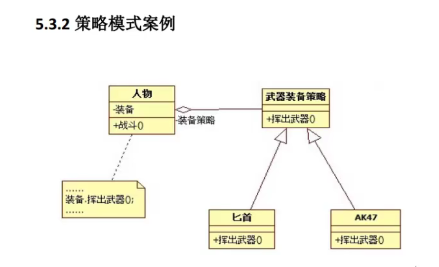

# designPattern
设计模式学习笔记

[开闭原则](./开闭原则/calculator.cpp)

[迪米特法则（最少知识原则）](./迪米特法则（最少知识原则）/test.cpp)

[代理模式](./代理模式/test.cpp)

[单例模式](./单例模式/test.cpp)

[外观模式](./外观模式/test.cpp)

[适配器模式](./适配器模式/test.cpp)

[依赖倒置原则](./依赖倒转原则/test.cpp)

[合成复用原则](./合成复用原则/test.cpp)

[简单工厂模式](./简单工厂模式/test.cpp)

[工厂方法模式](./工厂方法模式/test.cpp)

[抽象工厂模式](./抽象工厂模式/test.cpp)

[策略模式](./策略模式/test.cpp)

[命令模式](./命令模式/test.cpp)

